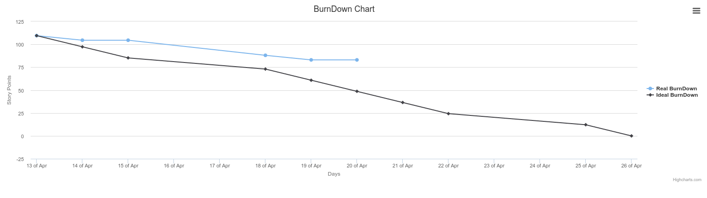

# Php Trello Burndown

[](https://twitter.com/intent/tweet?text=Wow:&url=%5Bobject%20Object%5D) [](https://raw.githubusercontent.com/seblegall/php-trello-burndown/master/LICENSE.md) [](https://travis-ci.org/seblegall/php-trello-burndown) [](https://scrutinizer-ci.com/g/seblegall/php-trello-burndown/?branch=master) [](https://scrutinizer-ci.com/g/seblegall/php-trello-burndown/?branch=master)

A PHP Scrum burndown generator based on Trello API.

This lib helps you to generate a Story Point Burndown chart based on Trello.



## Requirements
* PHP > 7.0
* Composer

## Installation

Using composer :
```sh
$ composer require seblegall/php-trello-burndown
```

## Usage
```PHP
// Create a new sprint
$sprint = new \TrelloBurndown\Model\Sprint();
// Set a start date
$sprint->setStart(new \DateTime('2016-05-24'));
// Set a duration
$sprint->setDuration(new \DateInterval('P14D'));

//Create a new Trello Client
$trelloClient = new \TrelloBurndown\Client\TrelloClient('{Your Key}', '{Your Token');

// Create a new generator and pass your client as argument.
$burndownGenerator = new \TrelloBurndown\BurndownGenerator($trelloClient);
/*
 * Add on or more board with the board full name.
 * Pay attention, if the board name is wrong or cannot
 * be find with your Trello client connection, this will do nothing.
 */
$burndownGenerator->addBoard('My Board');
/*
 * Add one or more Todo List with the list full name.
 * If you have add more than one board and some of the boards you've  add
 * contain lists with the same name, you can specify the board name as second parameter.
 * addTodoList('Todo', 'My second Board');
 *
 */
$burndownGenerator->addTodoList('Todo');
/*
 * Add one or more Work In Progress list with the list full name.
 */
$burndownGenerator->addWipList('In Progress');
/*
 * Add one or more Done list with the list full name.
 */
$burndownGenerator->addDoneList('To Validate 1');
$burndownGenerator->addDoneList('To Validate 2');

/*
 * Generate the Story Point Burndown by passing the sprint as agument.
 * This method will return a StoryPointBurndown Object
 */
$burndown = $burndownGenerator->getStoryPointBurndown($sprint);

/*
 * Call the generate() method to get an array representing your burndown
 */
 echo $burndown->generate();
```

[Read more about usage in the doc.](./doc/index.md)

## Usage with Trello
TrelloBurnown generate a burndown chart base on story points you indicate in each card name.

In order to be read by the burndow generator, story points must be include in the card name, surrounded by parenthesis.

Examples :

* `(3) Card Name` will return `3`
* `   (2) Card Name` will return `2`
* `(1)      Card Name` will return `1`
* `(0.5) Card Name` will return `0.5`


## Contributing
Feel free to make any comments, file issues or make pull requests.

See [https://github.com/seblegall/php-trello-burndown-dev-env](https://github.com/seblegall/php-trello-burndown-dev-env) to run the lib and work on it.

## Documentation
[See more](./doc/index.md)

## License
`php-trello-burndow` is licensed under the MIT License - see the LICENSE file for details

